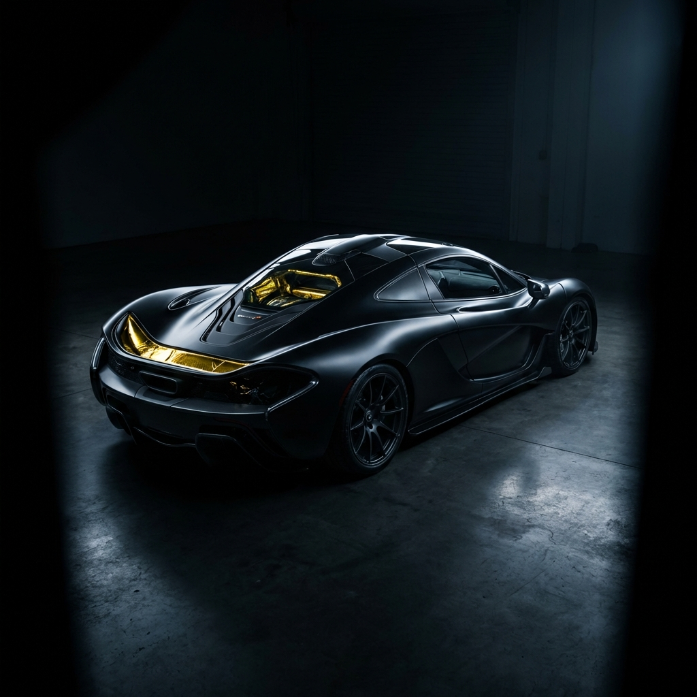

# LANZANTE | Historic Motorsport & Engineering



## Overview

A premium digital experience for **Lanzante**, verifying the brand's position at the intersection of historic motorsport and cutting-edge engineering. This project implements a high-fidelity "Technical Workshop" design language, featuring split-screen layouts, precise typography, and immersive interactions.

**Live Demo:** [https://atharv834.github.io/lanzante/](https://atharv834.github.io/lanzante/)

## Tech Stack

-   **Core:** React 18, Vite
-   **Styling:** Vanilla CSS (Custom Design System), CSS Variables
-   **Animations:** Framer Motion
-   **Routing:** React Router DOM

## Key Features

### 1. Technical Split-Layouts
A distinct UX pattern separating context from content, used on technical pages:
-   **Careers:** Scrollable job manifestos paired with sticky headers.
-   **Projects:** Filterable bespoke division index with interactive cards.
-   **Historic:** Department specifications and service protocols.

### 2. Immersive Visuals
-   **Noise Overlays:** Subtle grain effects to mimic film/analog texture.
-   **Micro-Interactions:** Gold border reveals, bracket animations, and magnetic buttons.
-   **Responsive Mobile Menu:** Full-screen overlay with stagaggered animations.

### 3. Engineering-First Aesthetics
-   **Typography:** Monospace data readouts mixed with classic serif headers.
-   **Color Palette:** Deep Black (`#0a0a0a`), Tech Gold (`#d4af37`), and Dimmed White.

## Local Development

```bash
# Install dependencies
npm install

# Run development server
npm run dev
```

## Deployment

This project is configured for **GitHub Pages**.

```bash
# Build and Deploy
npm run deploy
```

---

*Concept and Design by Antigravity Agency.*
